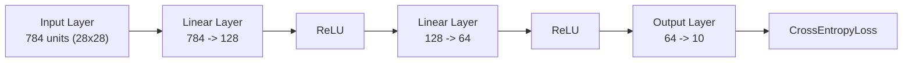

<div align="center">

# Fashion-MNIST Classification with PyTorch ANN

An end-to-end Artificial Neural Network (ANN) implementation for classifying fashion apparel from the Fashion-MNIST dataset using PyTorch, with dedicated workflows for CPU and GPU environments.

[](https://www.python.org/)
[](https://pytorch.org/)
[](https://developer.nvidia.com/cuda-zone)
[](https://scikit-learn.org/)
[](https://pandas.pydata.org/)
[](https://jupyter.org/)

[Overview](#overview) • [Architecture](#model-architecture) • [Dataset](#dataset-overview) • [Project Structure](#project-structure) • [Setup & Installation](#setup--installation) • [Usage](#usage) • [Results](#results--evaluation)

</div>

---

## Overview

This repository implements a multi-layer perceptron (Artificial Neural Network) in PyTorch to classify 28×28 grayscale images of clothing items into 10 distinct categories.

Two self-contained workflows are provided:
- **CPU Workflow (`without_gpu.ipynb`)**: Designed for lightweight local execution using a curated subset (`fmnist_small.csv`), eliminating the need for large downloads or dedicated GPU hardware.
- **GPU Workflow (`with_gpu.ipynb`)**: Leverages CUDA acceleration, automatic dataset retrieval via `kagglehub`, pinned memory loaders, and training on the complete 60,000-image dataset.

> [!NOTE]
> Both notebooks encapsulate the full machine learning lifecycle: data ingestion, exploratory visualization, normalization, PyTorch Dataset/DataLoader abstraction, model definition, backpropagation training, and test evaluation.

---

## Model Architecture

The neural network is built with `torch.nn.Sequential` using fully connected layers with non-linear activations:



### Layer Specifications

| Layer | Type | Input Dimension | Output Dimension | Activation |
|---|---|---|---|---|
| **Input** | Flattened Image | 28 × 28 | 784 | — |
| **Hidden 1** | `nn.Linear` | 784 | 128 | ReLU |
| **Hidden 2** | `nn.Linear` | 128 | 64 | ReLU |
| **Output** | `nn.Linear` | 64 | 10 | Logits (Softmax via CrossEntropyLoss) |

### Training Hyperparameters

- **Loss Function**: `nn.CrossEntropyLoss()`
- **Optimizer**: Stochastic Gradient Descent (`optim.SGD`)
- **Learning Rate**: `0.1`
- **Batch Size**: `32`
- **Epochs**: `10`

---

## Dataset Overview

The dataset consists of 28×28 grayscale images mapped into 10 class categories:

| Label | Category | Label | Category |
|:---:|---|:---:|---|
| **0** | T-shirt / Top | **5** | Sandal |
| **1** | Trouser | **6** | Shirt |
| **2** | Pullover | **7** | Sneaker |
| **3** | Dress | **8** | Bag |
| **4** | Coat | **9** | Ankle boot |

### Data Pipeline
1. **Feature Normalization**: Pixel values in range `[0, 255]` are scaled to `[0.0, 1.0]` by dividing by `255.0`.
2. **Train/Test Split**: Stratified split with an 80/20 train-to-test ratio via `train_test_split`.
3. **Custom Dataset**: A `torch.utils.data.Dataset` subclass converts NumPy feature arrays and targets into PyTorch tensors (`torch.float32` and `torch.long`).
4. **DataLoaders**: Mini-batch loading with shuffling enabled for training, and memory pinning for GPU transfers.

---

## Project Structure

```text
fashion-mnist-ann-pytorch/
├── dataset/
│   └── fmnist_small.csv      # Sampled subset for fast CPU experimentation
├── cpu_to_gpu.pdf            # Reference notes on transitioning from CPU to GPU training
├── with_gpu.ipynb            # GPU pipeline with automated KaggleHub download
├── without_gpu.ipynb         # CPU pipeline using the local dataset subset
├── .gitignore                # Git ignore patterns
└── README.md                 # Project documentation
```

---

## Setup & Installation

### 1. Clone the Repository

```bash
git clone https://github.com/fatin-israq/fashion-mnist-ann-pytorch.git
cd fashion-mnist-ann-pytorch
```

### 2. Set Up a Virtual Environment

```bash
python3 -m venv venv
source venv/bin/activate  # On Windows: venv\Scripts\activate
```

### 3. Install Dependencies

```bash
pip install torch torchvision pandas numpy scikit-learn matplotlib jupyter kagglehub
```

> [!TIP]
> For GPU acceleration, ensure you install a PyTorch build with CUDA support compatible with your system from the [official PyTorch installation matrix](https://pytorch.org/get-started/locally/).

---

## Usage

Launch Jupyter Notebook or JupyterLab:

```bash
jupyter notebook
```

Choose the notebook suited for your environment:

### Option A: Local / CPU (`without_gpu.ipynb`)
- Operates directly out of the box with `dataset/fmnist_small.csv`.
- No Kaggle account or GPU hardware required.
- Completes training in seconds on standard CPU hardware.

### Option B: Accelerated / GPU (`with_gpu.ipynb`)
- Automatically fetches the full Fashion-MNIST dataset from KaggleHub (`zalando-research/fashionmnist`).
- Detects and utilizes CUDA via `torch.device('cuda' if torch.cuda.is_available() else 'cpu')`.
- Trains on all 60,000 samples for higher classification accuracy.

---

## Results & Evaluation

| Pipeline | Hardware | Training Set | Test Set | Epochs | Test Accuracy |
|---|---|---|---|---|---|
| **`without_gpu.ipynb`** | CPU | 4,800 samples | 1,200 samples | 10 | **83.67%** (1,004 / 1,200) |
| **`with_gpu.ipynb`** | GPU (CUDA) | 48,000 samples | 12,000 samples | 10 | **87.97%** (10,556 / 12,000) |

> [!IMPORTANT]
> Because Fashion-MNIST features intricate clothing textures, fully-connected networks (ANNs) typically top out around 87–89% accuracy. For higher performance (>92%), consider extending the architecture to Convolutional Neural Networks (CNNs).
